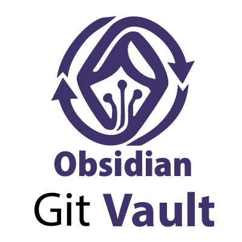
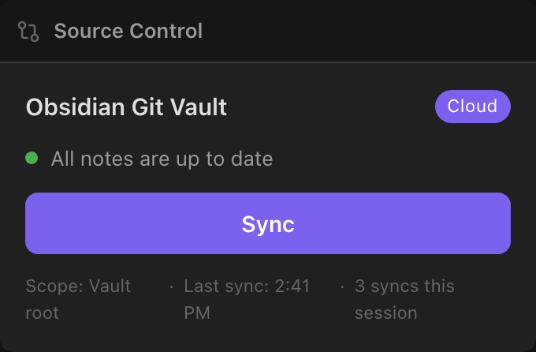
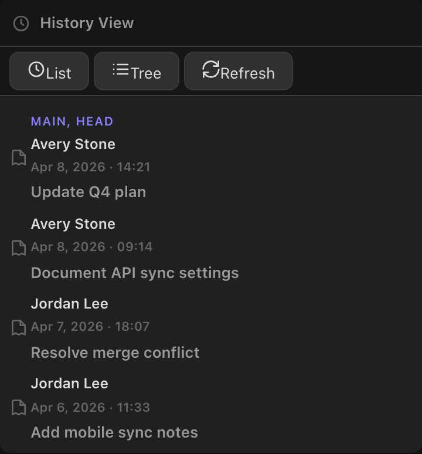

# Obsidian Git Vault — Dream-Wood Forgejo Edition

> [!IMPORTANT]
> This is a substantially modified fork maintained at
> [Dream-Wood/obsidian-git-vault](https://github.com/Dream-Wood/obsidian-git-vault).
> The upstream project is
> [redoracle/obsidian-git-vault](https://github.com/redoracle/obsidian-git-vault).
> Forgejo sync in this edition uses a new Git transaction engine; support for
> these changes belongs in the Dream-Wood issue tracker, not upstream.

Obsidian Git Vault adds reliable, versioned syncing to your Obsidian vault. On desktop it uses the system Git client for full Git workflows. GitHub and GitLab remain API-backed; Forgejo uses native Git on desktop and an isolated isomorphic-git worktree on mobile. Key features include smart sync triggers, a visual conflict resolver, optional API encryption for API providers, per-file sync metadata, and two UI modes tailored for different workflows.

[](https://github.com/Dream-Wood/obsidian-git-vault/releases)

[](https://github.com/Dream-Wood/obsidian-git-vault/releases)
[](https://github.com/Dream-Wood/obsidian-git-vault/stargazers)
[](https://github.com/Dream-Wood/obsidian-git-vault/issues)
[](https://github.com/Dream-Wood/obsidian-git-vault/commits/main)
[](LICENSE)
[](https://www.typescriptlang.org)
[](https://svelte.dev)
[](https://obsidian.md)
[](https://github.com/Dream-Wood/obsidian-git-vault/pulls)

---

## Why Obsidian Git Vault

| Problem                                 | What this plugin does                                             |
| --------------------------------------- | ----------------------------------------------------------------- |
| Git is complex for everyday sync        | Simple Mode gives one-click sync with no Git terminology          |
| Mobile devices typically lack a Git CLI | Forgejo uses isolated isomorphic-git; APIs remain available       |
| Conflicts are hard to resolve           | Visual conflict resolver with side-by-side diffs                  |
| Sync is easy to forget                  | Smart triggers run sync on file change, idle, close, or reconnect |

---

## Features

### Core

- Automatic commit, pull, and push on a configurable schedule
- Source Control view for staging, diffing, and committing without leaving Obsidian
- History view to inspect commits and changed files
- Inline and split diff viewer
- Editor gutter signs showing line-level authorship and changes (desktop with Git)
- Submodule support (desktop with Git)
- Quick jump to a file on a hosting site via Open in GitHub

### Hosted sync backends

Use GitHub, GitLab, or Forgejo as a configured sync target. GitHub and GitLab use their repository APIs. Forgejo uses the normal Git smart-HTTP protocol and creates a real local repository on desktop.

### Mobile and triggers

- Mobile-first sync using API backends or Forgejo through isomorphic-git
- Smart triggers: on file change (debounced), on app close, on network reconnect, and after idle

### Conflict resolution and UI modes

- Visual conflict resolver with Keep Local, Keep Remote, or Edit Manually options
- Batch conflict resolution across files
- Conflict strategies: `manual`, `last-write-wins`, `always-local`, `always-remote`
- Simple Mode: one-button sync with a live status indicator
- Advanced Mode: full source control UI with staging, history, and commit control

### Architecture

- Built around a `SyncProvider` interface so multiple backends share the same sync core

---

## Screenshots



> One-button sync, a live status dot, provider badge, and a shortcut to the conflict resolver.


> Stage files or hunks, write a commit message, and push.


> Compare local and remote versions and resolve conflicts file by file.



> Browse commits, inspect changed files, and review authors.

---

## How it works

The plugin uses three transport paths and selects the appropriate one from the provider and platform: native Git, isolated mobile isomorphic-git, or a hosted-provider API.

### Git mode (desktop)

On desktop the plugin prefers the system Git client for full-featured workflows. An isomorphic Git fallback is available when needed.

```text
Vault changes → Stage → Commit → Push → Remote (GitHub / any Git host)
                  ↑
         Pull / Fetch merges remote changes
```

### Hosted backends on mobile

On devices without Git, GitHub and GitLab communicate through repository APIs. Forgejo uses isomorphic-git in an isolated worktree under `.obsidian/.git-vault-mobile`; only scoped user files are copied into the vault.

```text
Vault files ──→ GitHub / GitLab API or Forgejo Git protocol
                    ↑↓
    Bidirectional diff + upload/download + metadata
```

GitHub/GitLab API sync supports scoping, excluded paths, and optional payload encryption. Forgejo supports scoping and excluded paths but stores normal Git blobs; see [Forgejo Sync](docs/Forgejo-Sync.md).

### Credential migration note

The plugin no longer ships an embedded askpass helper. Desktop Git authentication uses system credential helpers. If you previously used the plugin askpass flow, migrate to a system helper.

Recommended helpers:

- Git Credential Manager (GCM): <https://aka.ms/gcm>
- macOS Keychain helper: `git-credential-osxkeychain`
- ssh-agent or your platform SSH agent for key-based auth

Quick troubleshooting:

1. Check the configured helper: `git config --global credential.helper`
2. List SSH agent keys: `ssh-add -l`
3. On macOS, install or enable GCM if needed: `brew install --cask git-credential-manager-core`

See `CHANGELOG.md` and `src/gitManager/simpleGit.ts` for migration details.

---

## Provider behavior in this release

- **Git (local)**: Full Git workflow with history, file-at-commit restore, submodules, and history rewrite tools. Not API-backed; no tracked-directory scoping or API encryption.
- **GitHub API**: Desktop and mobile. Supports per-file metadata, tracked-directory scoping, excluded paths, encrypted API sync, remote file URLs in the metadata sidebar, and atomic multi-file commits where available. Does not provide a history view inside the app.
- **GitLab API**: Desktop and mobile. Same app-level surface as GitHub, including atomic multi-file commits via the repository commits API. Remote file URLs are available when configured with a namespace/project path; numeric project IDs limit URL generation.
- **Forgejo Git**: Desktop and mobile. Requires system Git on desktop and uses isomorphic-git on mobile. Every sync performs one fetch, a real three-way merge, at most one local commit, and one push. Conflicts are resolved atomically. `.obsidian`, `.git`, and plugin index data are never part of the sync scope. API payload encryption and dedicated API import do not apply.

The GitHub and GitLab API backends can import a selected remote into a dedicated desktop vault, auto-detect the host's default branch when needed, and require a pull-first baseline after repo identity changes. When API encryption is enabled, the importing device must have the passphrase stored locally before files are written.

### Encrypted sync on a new device

To import a remote that uses API encryption:

1. Install Obsidian and Obsidian Git Vault on the device.
2. Configure the same provider, repository, and branch in Settings → Obsidian Git Vault.
3. Enter the shared passphrase in Settings → Encryption. The passphrase is stored in Obsidian's secret storage on this device only.
4. Use Use Selected Remote → choose the vault folder option. The import proceeds since the passphrase is available.

Manual per-file Encrypt/Decrypt actions are separate and operate on the local file regardless of sync backend.

---

## Supported providers

- **Git** (`git`) — Desktop only. Requires a local repository. Offers history, file restore from commits, submodule support, and atomic batch commits via Git.
- **GitHub API** (`github`) — Desktop and mobile. API-backed; requires a Personal Access Token. Supports atomic multi-file commits, per-file metadata, tracked-directory scoping, excluded paths, encrypted API sync, dedicated vault import, default-branch auto-detection, and browseable remote file URLs.
- **GitLab API** (`gitlab`) — Desktop and mobile. API-backed; requires a Personal Access Token. Similar to GitHub: multi-file commits, per-file metadata, tracked-directory scoping, excluded paths, encrypted API sync, and dedicated vault import. Remote URLs require a namespace/project path for browseable links.
- **Forgejo Git** (`gitea`) — Desktop and mobile. Uses system Git plus the OS credential helper on desktop and isomorphic-git plus the configured PAT on mobile. Supports tracked-directory scoping, excluded paths, remote URLs, atomic commits, and true three-way conflicts.

Authoritative capability declarations live in `src/syncProvider/providerRegistry.ts`.

### Feature matrix

| Capability                              | Git                      | GitHub API    | GitLab API                 | Forgejo Git              |
| --------------------------------------- | ------------------------ | ------------- | -------------------------- | ------------------------ |
| Manual per-file Encrypt / Decrypt       | Supported                | Supported     | Supported                  | Supported                |
| Encrypted API sync file-content storage | Not applicable           | Supported     | Supported                  | Not applicable           |
| Tracked directory and excluded paths    | Not supported            | Supported     | Supported                  | Supported                |
| Per-file sync metadata                  | Supported                | Supported     | Supported                  | Supported                |
| Remote file URL in metadata view        | Not supported            | Supported     | Supported (namespace path) | Supported                |
| Atomic multi-file remote write          | Supported via Git commit | Supported     | Supported                  | Supported via Git commit |
| Dedicated vault import on desktop       | Not supported            | Supported     | Supported                  | Not supported            |
| Auto-detect default branch              | Not applicable           | Supported     | Supported                  | Supported                |
| History view in the app                 | Supported                | Not supported | Not supported              | Not supported            |

---

## Sync modes

### Simple Mode

One-button sync for users who prefer a minimal workflow. Shows a live status indicator and a provider badge. Conflicts open the visual resolver.

### Advanced Mode

Full source control UI with staging, custom commit messages, independent pull and push, history browsing, and submodule management.

Both modes use the same `SyncManager` state and conflict UI; the selected provider determines the transport engine.

---

## Cross-platform support

| Feature                         | Desktop                  | Mobile                         |
| ------------------------------- | ------------------------ | ------------------------------ |
| System Git transport            | ✅ mandatory for Git/Forgejo | ❌                          |
| Isolated Forgejo isomorphic-git | Not used                 | ✅                             |
| GitHub/GitLab API backends      | ✅                       | ✅                             |
| Source Control View             | ✅                       | ✅                             |
| Simple Mode                     | ✅                       | ✅ recommended                 |
| Advanced Mode                   | ✅                       | ✅ limited by mobile transport |
| Editor signs                    | ✅                       | ❌                             |
| Submodule support               | ✅                       | ❌                             |

Mobile defaults to an API backend and Simple Mode, but both can be changed in Settings.

---

## Installation

### Dream-Wood release (recommended for this edition)

1. Download `git-vault.zip`, or `main.js`, `manifest.json`, and `styles.css`, from the [latest Dream-Wood release](https://github.com/Dream-Wood/obsidian-git-vault/releases/latest).
2. Extract/copy the files into `.obsidian/plugins/git-vault/` in your vault.
3. Reload Obsidian and enable **Obsidian Git Vault** under Community Plugins.

The Community Plugins listing may point to the upstream edition and should not
be assumed to contain the Dream-Wood Forgejo engine.

### Build from source

```bash
git clone https://github.com/Dream-Wood/obsidian-git-vault.git
cd obsidian-git-vault
pnpm install
pnpm run build
```

Copy `main.js`, `manifest.json`, and `styles.css` into
`.obsidian/plugins/git-vault/`.

### Git requirement

- Desktop (`Git` or `Forgejo Git`): system Git is mandatory and checked during startup.
- Mobile `Forgejo Git`: uses the bundled isomorphic-git dependency; no Git binary is required.
- GitHub/GitLab API mode: no Git binary is required.

---

## Quick start

### Simple mode with Forgejo

1. Install Obsidian Git Vault and enable it
2. In Settings → Obsidian Git Vault set UI Mode to Simple
3. Choose **Forgejo Git**.
4. Enter the Forgejo URL, token, owner, repository, and branch.
5. Enable Smart Triggers as needed
6. Open the Source Control sidebar and click Sync. The transaction performs one fetch, a three-way merge, at most one commit, and one push.

For GitHub or GitLab, choose the matching API backend instead. Those providers retain their API-specific import and encryption features.

> Provider tokens are stored in Obsidian's secret storage on each device. If you previously stored tokens in plugin data files or synced settings, rotate those tokens and remove legacy copies.

### Advanced mode with local Git

1. Ensure Git is installed: `git --version`
2. Initialize or clone a repo into your vault root
3. In Settings set UI Mode to Advanced and Sync Backend to Git
4. Configure commit schedule and pull/push behavior

---

## Use cases

- Personal knowledge base: automatic versioning for notes and logs
- Multi-device sync: desktop for full Git workflows, mobile via API sync
- Team workflows: shared private repos with history and diffs
- Automated backups: scheduled commits keep an audit trail of changes
- Experimental branches: keep drafts and merge to `main` when ready

---

## Architecture overview

```text
┌─────────────────────────────────────────────────┐
│                  Obsidian Git Vault             │
│                                                 │
│  ┌──────────┐   ┌──────────────────────────┐    │
│  │  Simple  │   │       Advanced Mode      │    │
│  │   Mode   │   │  (Stage/Commit/History)  │    │
│  └────┬─────┘   └────────────┬─────────────┘    │
│       │                      │                  │
│       └──────────┬───────────┘                  │
│                  ▼                              │
│         ┌────────────────┐                      │
│         │   SyncManager  │  ← Smart Triggers    │
│         │  + SyncState   │     (file/idle/net)  │
│         └───────┬────────┘                      │
│                 │                               │
│       ┌────────┬───────────────┬───────────┐     │
│       ▼        ▼               ▼           │
│  Native Git  Forgejo Git   GitHub/GitLab   │
│  desktop     transaction      APIs         │
│              ┌──────────┐                  │
│              │ desktop: native Git         │
│              │ mobile: isolated iso-git    │
│              └──────────┘                  │
└──────────┬──────────┬──────────────┬────────┘
           ▼          ▼              ▼
      Git remote  Forgejo remote  Provider API
```

## Key modules

Key modules are organized around a `SyncProvider` interface that abstracts the sync engine from the UI and allows multiple backends to share the same core logic. The `SyncManager` handles provider selection, smart triggers, and conflict routing. The `SyncStateManager` tracks sync status and metadata in a reactive store. The `ConflictModal` provides a visual interface for resolving conflicts.

| Module                   | Role                                                     |
| ------------------------ | -------------------------------------------------------- |
| `SyncProvider`           | Interface that decouples UI from sync implementations    |
| `GitSyncProvider`        | Adapter over `GitManager` (simple-git / isomorphic-git)  |
| `GitHubApiSyncProvider`  | REST API engine with no binary dependency                |
| `ForgejoGitSyncProvider` | One-fetch three-way Git transaction for Forgejo          |
| `SyncStateManager`       | Centralized reactive state tracking                      |
| `SyncManager`            | Provider selection, smart triggers, and conflict routing |
| `ConflictModal`          | Visual resolver with per-file resolution tracking        |

---

## Roadmap

| Status | Item                                               |
| ------ | -------------------------------------------------- |
| ✅     | Git mode with full CLI and isomorphic-git fallback |
| ✅     | Gitless mode via provider APIs                     |
| ✅     | Simple Mode UI                                     |
| ✅     | Advanced Mode UI                                   |
| ✅     | Visual conflict resolver                           |
| ✅     | Smart sync triggers                                |
| ✅     | Mobile-first defaults                              |
| ✅     | GitLab API backend                                 |
| ✅     | Atomic Forgejo Git engine on desktop and mobile    |
| ✅     | Conflict resolution history log                    |
| ✅     | Tracked directory and exclude-path support         |
| ✅     | Encrypted API sync                                 |
| ✅     | Per-file sync metadata sidebar                     |

---

## Contributing

Contributions are welcome. Read [CONTRIBUTING.md](CONTRIBUTING.md); for larger changes, open a Dream-Wood issue to discuss the approach first.

```bash
# Clone and set up
git clone https://github.com/Dream-Wood/obsidian-git-vault.git
cd obsidian-git-vault
pnpm install

# Build
pnpm run build

# Watch mode (development)
pnpm run dev
```

To verify the repository without making changes, run `make check`. This runs TypeScript checks, Svelte checks, a Prettier check across source and docs, and linting. To apply formatting, run `make format-repo-write` (or `make format-write` for `src`).

Stack: TypeScript · Svelte 5 · esbuild · Obsidian Plugin API

To test locally, copy `main.js`, `manifest.json`, and `styles.css` into a test vault's `.obsidian/plugins/git-vault/` directory and enable the plugin.

Follow the existing code style. New sync backends should implement `SyncProvider` in `src/syncProvider/syncProvider.ts`.

---

## License

[MIT License](LICENSE). See [NOTICE.md](NOTICE.md) for upstream attribution and a summary of Dream-Wood changes.

---

## Credits

This edition is maintained by Dream-Wood and is based on [redoracle/obsidian-git-vault](https://github.com/redoracle/obsidian-git-vault), which in turn builds on earlier work by Vinzent03 and Denis Olehov. Existing copyright notices are retained. The Forgejo transaction engine and associated safety/performance changes are Dream-Wood modifications described in [NOTICE.md](NOTICE.md).

## Support

Report Dream-Wood edition bugs and feature requests in the [issue tracker](https://github.com/Dream-Wood/obsidian-git-vault/issues). For Forgejo problems, include platform, Git version (desktop), Forgejo version, selected branch, and the plugin sync audit excerpt without tokens or credentials.
